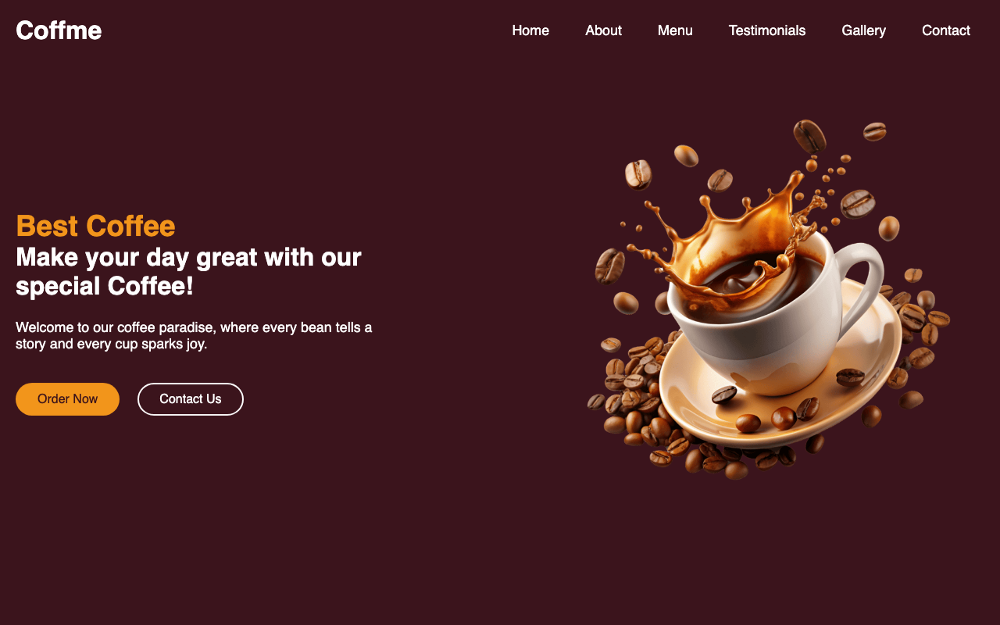

# ☕ Coffme — Artisan Coffee Shop Landing Page

[](https://alfiansyah.id/coffme/)
[](https://developer.mozilla.org/en-US/docs/Web/HTML)
[](https://developer.mozilla.org/en-US/docs/Web/CSS)
[](https://developer.mozilla.org/en-US/docs/Web/JavaScript)
[](https://alfiansyah.id/coffme/)

> A modern, responsive, and visually stunning landing page for an artisan coffee shop, built with pure HTML5, modern CSS3, and Vanilla JavaScript.

---

## 📸 Preview



🔗 **Live Website:** [https://alfiansyah.id/coffme/](https://alfiansyah.id/coffme/)

---

## ✨ Key Features

- **☕ Animated Hero Section** — Elegant entrance animations featuring a coffee cup that gently bobs up and down (*infinite floating animation*).
- **📜 Menu & Pricing** — Comprehensive menu categories (Hot & Cold Beverages, Refreshments, Combos, Desserts) with sleek, modern transparent price badges.
- **🌟 Testimonials Carousel** — Interactive, touch-friendly customer review slider powered by **Swiper.js**.
- **🖼️ Photo Gallery** — Responsive photo grid with smooth hover zoom micro-interactions.
- **📩 Interactive Contact Section** — Functional client-side contact form with real-time submission feedback without page reload, along with direct `tel:` and `mailto:` action links.
- **📱 Fully Responsive Design** — Mobile-first navigation featuring an off-canvas drawer with backdrop blur.
- **🚀 High Performance** — Hardware-accelerated scroll-reveal animations using the native `IntersectionObserver` API with zero bloat.

---

## 🛠️ Tech Stack

- **Markup:** Semantic HTML5
- **Styling:** Vanilla CSS3 (Custom Properties / CSS Variables, Flexbox, Grid, Custom Keyframes)
- **Logic:** Vanilla JavaScript (ES6+, DOM Manipulation, IntersectionObserver)
- **Libraries & Assets:**
  - [Swiper.js 12](https://swiperjs.com/) — Touch slider & carousel
  - [Font Awesome 6.6](https://fontawesome.com/) — Vector icons
  - [Google Fonts](https://fonts.google.com/) — *Poppins* & *Miniver*
- **Deployment:** GitHub Pages via GitHub Actions CI/CD with Custom Domain ([alfiansyah.id](https://alfiansyah.id))

---

## 📂 Project Structure

```text
coffee-website/
├── .github/
│   └── workflows/
│       └── static.yml       # GitHub Actions deployment workflow
├── images/
│   ├── preview.png          # Website preview screenshot
│   ├── coffee-hero-section.png
│   ├── gallery-1.jpg ... gallery-6.jpg
│   └── user-1.jpg ... user-5.jpg
├── index.html               # Main semantic HTML5 document
├── style.css                # Custom styling, theme variables & animations
├── script.js                # Slider, mobile navbar & scroll reveal logic
└── README.md                # Project documentation
```

---

## 🚀 Running Locally

1. **Clone the repository:**
   ```bash
   git clone https://github.com/Alfiyansya/coffme.git
   ```

2. **Navigate to the project directory:**
   ```bash
   cd coffme
   ```

3. **Launch the website:**
   - Open `index.html` directly in your favorite web browser, or
   - Use the **Live Server** extension in VS Code.

---

## 👤 Author

- **Website:** [alfiansyah.id](https://alfiansyah.id)
- **GitHub:** [@Alfiyansya](https://github.com/Alfiyansya)

---

⭐ *If you find this project helpful or inspiring, please consider giving it a star on GitHub!*
